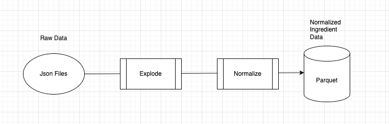

# All Recipes POC

Usage guide:
This POC uses `python3`.

First install the required requirements
```
pip3 install -r requirements.txt
```

Then let's run the mini data pipeline by first downloading the raw file
`python3 transformations/download_raw_data.py`

Then we normalize the ingredients:
`python3 transformations/normalize_ingredients_data.py`


Finally we can start up our service
```
./run.sh
```

By default this will spin up the fast API on `localhost:8080`
Swagger can be found here: `http://localhost:8080/docs`
Configuration of the host and port can be done on the `run.sh` script.

The `GET` request to `localhost:8080/v1/ingredients-cooccurrence/{ingredient}`
will return the most frequently cooccurring ingredients. By default this will return 
the top ten results. However, you can also set the pagination with `page` and `limit`:
`http://localhost:8080/v1/ingredients-cooccurrence/salt?page=0&limit=5`

```
{
  "ingredient": "salt",
  "coocurrence": [
    {
      "ingredient": "butter",
      "counts": 10156
    },
    {
      "ingredient": "all-purpose flour",
      "counts": 9966
    },
    {
      "ingredient": "white sugar",
      "counts": 9559
    },
    {
      "ingredient": "onion",
      "counts": 8300
    },
    {
      "ingredient": "black pepper",
      "counts": 7148
    }
  ]
}
```

## Assumptions
There were a few assumptions made that drove the architecture design.
1. There does not need to be real time insights. Data can be read on a schedule and does not need to be updated in real time.
2. Prioritize reads over writes. It seems logical that a recipe site would have more reads than writes so let's optimize for that
3. The data set can fit into memory. DuckDb uses Apache Arrow under the hood so should be able to load files larger than available memory but unfortunately ran into some issues loading data so had to use pandas in some places. If the dataset is going to be much larger perhaps we can use something like Spark to process the data.

## Architecture and Design



Because we want to optimize for reads, I figured it would make sense to transform the data along the way and store it to disc.
In this situation it's optimized only for ingredient searching.
1. Raw data is first downloaded into the `data/raw` folder. The script to execute this can be found in `transformations/download_raw_data.py`. 
   * In this case we are downloaded the entire json of recipes and ingredients
   * in the future it would better to only download the new recipes that come in, perhaps on a nightly basis.
2. The data is then normalized to optimize for `ingredients` searching. The script to execute this can be found in `transformations/normalize_ingredients_data.py`
   * This scripts first explodes the data into individual rows 
   * Then does a regex to match the `term` with the `ingredient` found in the github repo.
      * The regex does an exact match so not all ingredients are matched. If nothing is matched then it will be removed as an ingredient.
3. The API then queries the saved parquet file for the most commonly used ingredients
   * Parquet was chosen mostly for read speeds. I tried also writing it as CSV which was quite a bit faster but in the end parquet seems faster to read so I went with that.

## Follow Up Items
* If I had more time I would have liked to have added more tests. I have a very simple test that checks the transformations but I should add another one for the query to find the similar ingredients
* Requirement #2. I did not have time to implement this but judging by the similarity rating I think I would use something like K-means Clustering 
* Improve the search. The regex works for the most part but there are definitely some gaps in the regex. For example in the ingredients list there is both `Black Pepper` and `Freshly Ground Pepper`. However, in the recipes there are over 2000 that refer to `freshly ground black pepper`, of which the regex matches to `black pepper`. This may or may not be the right answer depending on the need but something potentially to tweak. There's also additionally some ingredients that do not match with anything at all.


